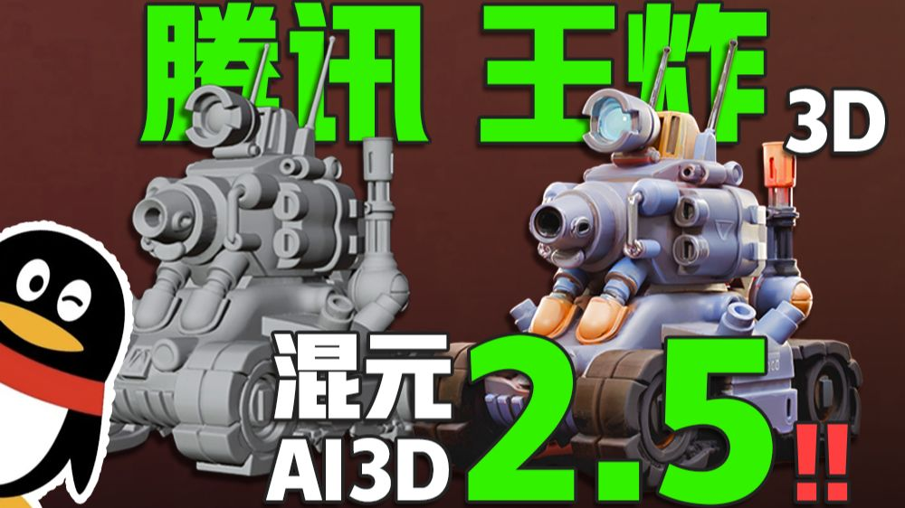
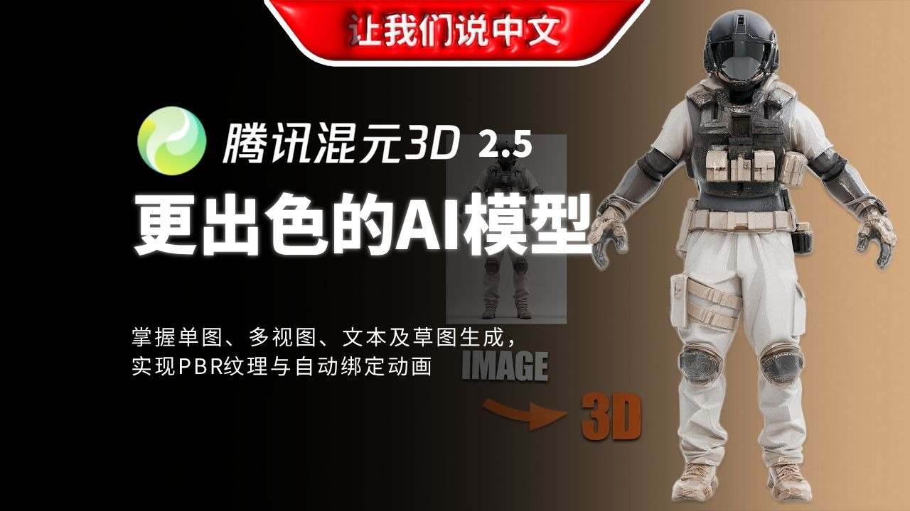
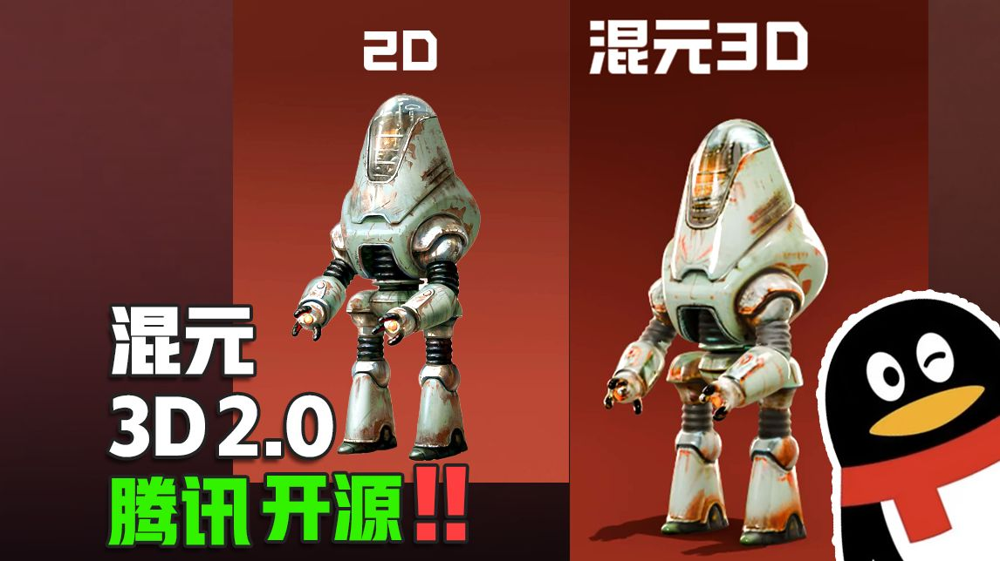
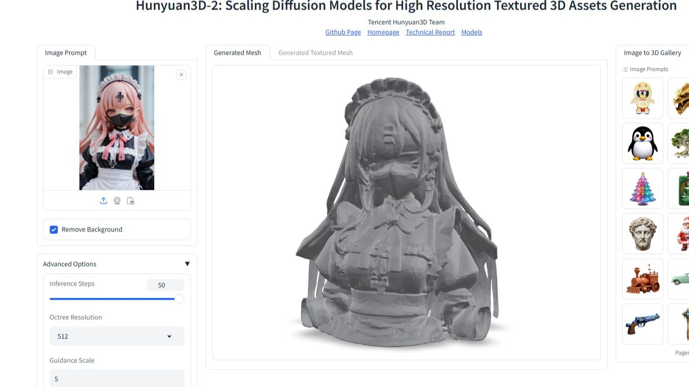
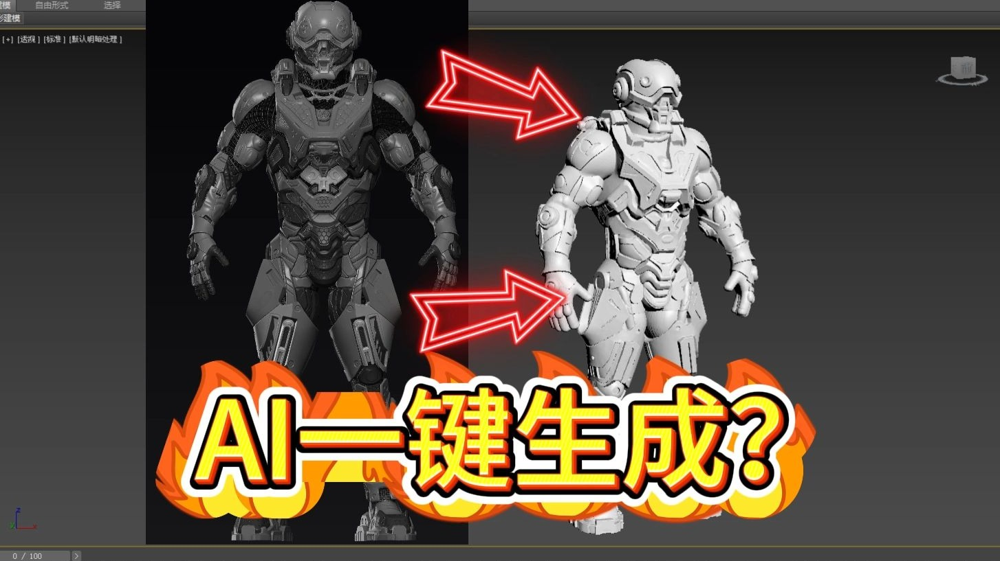

# 混元视频合集

## 热门视频

1. [AI+ZBrush召唤神龙! 从混元3D 2.5到ZBrush半小时搞定龙头雕刻！](https://www.bilibili.com/video/av114567967409756)  
     
   - 播放量：2454
   - 时长：05:16
   - 发布时间：2025-05-25

2. [使用腾讯混元(HunYuanVideo)视频模型FP8量化版本来生成绅士动画,模型体积30G,8G甜品卡可玩,2秒视频需要15分钟](https://www.bilibili.com/video/av113617102050637)  
     
   - 播放量：32316
   - 时长：02:18
   - 发布时间：2024-12-08

3. [AI3D里程碑，精度炸裂！腾讯混元3Dv2.5发布](https://www.bilibili.com/video/av114390481242484)  
     
   - 播放量：16758
   - 时长：07:58
   - 发布时间：2025-04-24

4. [混元3D 2.5丨比以往更出色的 AI 3D 模型！](https://www.bilibili.com/video/av114460140440012)  
     
   - 播放量：4264
   - 时长：26:39
   - 发布时间：2025-05-06

5. [腾讯混元HunyuanVideo：详解目前最高质量的开源视频生成模型，8G显存即可流畅运行](https://www.bilibili.com/video/av113826632631149)  
     
   - 播放量：42119
   - 时长：18:19
   - 发布时间：2025-01-15

6. [腾讯混元3D2.0开源，详细测评](https://www.bilibili.com/video/av113878591605274)  
     
   - 播放量：38175
   - 时长：06:32
   - 发布时间：2025-01-23

7. [【教程】模型师的混元3D 2.0本地部署小教程，主打一个自己把自己送走 (¦3【▓▓】](https://www.bilibili.com/video/av114092299780370)  
     
   - 播放量：32690
   - 时长：12:23
   - 发布时间：2025-03-02

8. [建模师即将失业不再是一句玩笑话，混元ai建模质量飞升](https://www.bilibili.com/video/av114393350211931)  
     
   - 播放量：6922
   - 时长：06:31
   - 发布时间：2025-04-24

9. [人人都会的建模（腾讯混元3D建模）](https://www.bilibili.com/video/av114322349035614)  
     
   - 播放量：8210
   - 时长：11:38
   - 发布时间：2025-04-12

## 更多视频

[查看完整视频列表](https://www.bilibili.com/search?keyword=混元)