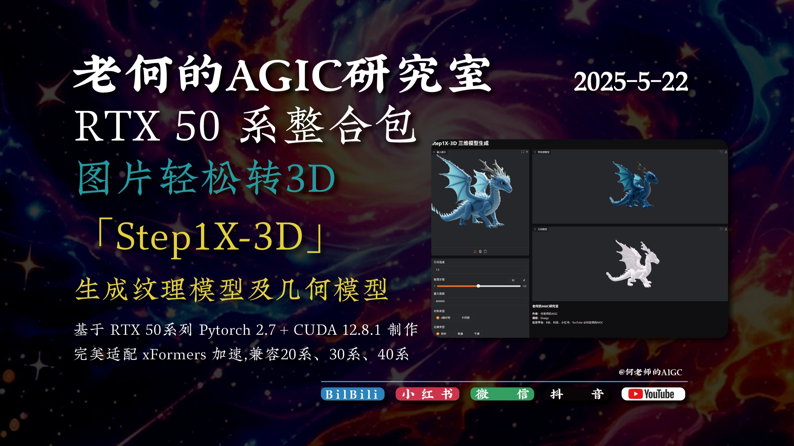

# 阶跃星辰AI视频合集

## 热门视频

1. [Step-Video开源24小时作品集锦｜全球创作者接力完成](https://www.bilibili.com/video/av114041599101175)  
  
- 播放量：8186  
- 时长：1:26  
- 发布时间：2025-02-21

2. [阶跃多模态大模型首次开源，视频+语音双厨狂喜！](https://www.bilibili.com/video/av114020728177404)  
  
- 播放量：38546  
- 时长：1:38  
- 发布时间：2025-02-18

3. [DeepSeek之后，多模态开源新卷王！【阶跃星辰】](https://www.bilibili.com/video/av114035576020926)  
  
- 播放量：81904  
- 时长：4:27  
- 发布时间：2025-02-20

4. [开源狠货！阶跃新开源视频模型+语音模型实测！](https://www.bilibili.com/video/av114052571336627)  
  
- 播放量：116463  
- 时长：4:07  
- 发布时间：2025-02-23

5. [国产开源多模态 AI ，用起来怎么样？阶跃星辰。](https://www.bilibili.com/video/av114036968523780)  
  
- 播放量：103897  
- 时长：5:17  
- 发布时间：2025-02-20

6. [阶跃星辰最新论文-慢感知：让我们逐步感知几何图形](https://www.bilibili.com/video/av113912280253015)  
  
- 播放量：11146  
- 时长：24:27  
- 发布时间：2025-01-29

7. [[50系整合包]5-22 💥炸裂发布！Step1X-3D阶跃星辰开源模型！](https://www.bilibili.com/video/av114550150141180)  
  
- 播放量：980  
- 时长：3:27  
- 发布时间：2025-05-22

8. [Ai绘画进阶167-超强图像编辑技术！阶跃星辰开源Step1X-Edit！贞贞穿上大花袄，你敢信？！手搓一个超强一致性图像编辑工作流-Comfyui教程](https://www.bilibili.com/video/av114414539772571)  
  
- 播放量：4382  
- 时长：8:55  
- 发布时间：2025-04-28

9. [Step-audio系列AI语音模型测试,AI语音生成,TTS,AI生成说唱(RAP),阶跃星辰团队开源](https://www.bilibili.com/video/av114034821042774)  
  
- 播放量：14507  
- 时长：2:41  
- 发布时间：2025-02-20

10. [Step1X-3D 一键包 阶跃星辰开源带纹理的3D生成 22G显存可用 支持50系](https://www.bilibili.com/video/av114505421952088)  
  
- 播放量：1239  
- 时长：1:03  
- 发布时间：2025-05-14

